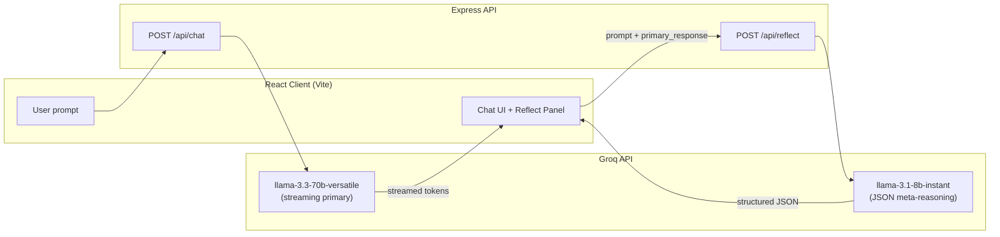

# Claude Reflect

**AI Output Transparency Layer** — a product case study in epistemic UX for generative AI.

[](https://vercel.com/new/clone?repository-url=https://github.com/parthkapoor2402/claude-reflect)


> *Built for the NextLeap PM Fellowship — May 2026*

---

## Table of Contents

- [Executive Summary](#executive-summary)
- [The Exact Problem](#the-exact-problem)
- [Current Market Gap](#current-market-gap)
- [Claude Reflect as a Product](#claude-reflect-as-a-product)
- [Key UX Features](#key-ux-features)
- [Data Pipeline](#data-pipeline)
- [Feasible Market Capture](#feasible-market-capture)
- [PM Roadmap — What to Build Next](#pm-roadmap--what-to-build-next)
- [Demo Scenarios](#demo-scenarios)
- [Architecture & Tech Stack](#architecture--tech-stack)
- [Getting Started](#getting-started)
- [API Reference](#api-reference)
- [Testing](#testing)
- [Deployment](#deployment)
- [Project Structure](#project-structure)
- [Research & Validation](#research--validation)

---

## Executive Summary

Generative AI tools optimize for **fluency**, not **epistemic honesty**. Users receive confident, well-written answers with no signal about what was assumed, where confidence drops, or what context only *they* can supply.

**Claude Reflect** is a reasoning transparency layer that runs **after** every assistant response. It does not replace human judgment — it structures where judgment is needed: assumptions, confidence zones, completeness gaps, and context-specific questions.

This repository is a full-stack reference implementation: streaming chat, meta-reasoning Reflect pass, zero-friction first-time onboarding, demo scenarios, and production deployment on Vercel.

---

## The Exact Problem

### User pain (validated, N=25)

| Signal | Finding |
|--------|---------|
| **Trust in completeness** | **3.16 / 5** — users do not trust that AI outputs are complete for real work |
| **Negative experience** | **88%** have been burned by incorrect or incomplete AI output in professional contexts |
| **Verification behaviour** | **56%** use passive or no verification — the product does not make verification easy |

### Structural product failure

Today's chat UIs treat every token stream as equally authoritative. There is no differentiated UX for:

1. **Low-stakes factual answers** (e.g. “What is photosynthesis?”)
2. **High-stakes analytical work** (e.g. market entry, hiring decisions, financial projections)
3. **Context-dependent judgment** (only the user knows their budget, risk appetite, or org constraints)

The failure mode is not only hallucination — it is **unmarked incompleteness**: plausible prose that omits working capital, regulatory risk, or missing metrics without any affordance to notice.

### Job to be done

> *When I use AI for consequential work, I want to see where the model's reasoning is thin — so I can verify the right things, ask the right follow-ups, and decide — without the product pretending to be a judge.*

---

## Current Market Gap

| Layer | What exists today | Gap Reflect addresses |
|-------|-------------------|------------------------|
| **Foundation models** | Strong generation; optional “reasoning” modes | No persistent **output-quality layer** tied to each response in-product |
| **Chat products** (ChatGPT, Claude, Gemini) | Regenerate, thumbs, copy | No structured **epistemic breakdown** (assumptions / gaps / user-only questions) |
| **Fact-checking / RAG tools** | External verification, citations | Binary correct/incorrect framing — not **“what wasn’t considered?”** |
| **Enterprise guardrails** | Policy, PII, toxicity filters | Compliance-focused — not **decision-quality** for PMs, operators, analysts |
| **Prompt engineering** | User-side burden to “ask better” | Shifts responsibility to users instead of **product-native transparency** |

**Whitespace:** A **non-verdict epistemic layer** — neither trust score nor fact-checker — embedded in the response lifecycle.

---

## Claude Reflect as a Product

### Positioning

| Dimension | Choice |
|-----------|--------|
| **Category** | AI Output Transparency / Epistemic UX |
| **Not** | Fact-checker, trust score, or auto-corrector |
| **Is** | Meta-reasoning companion that surfaces **questions**, not conclusions |
| **Integration model** | Sidecar layer on any chat backend (here: Groq + dual-model pipeline) |

### Core value proposition

After each AI response, Reflect answers four questions for the user:

| Dimension | User question | Example output |
|-----------|---------------|----------------|
| **Reasoning foundations** | What did the model assume? | *“Assumes uniform 25% monthly growth across all cohorts”* |
| **Confidence topology** | Where is confidence thinner? | *“Year 3 revenue figure rests on unchecked churn assumption”* |
| **Completeness gaps** | What angles were skipped? | *“No state-specific logistics regulation for tier-2”* |
| **Judgment prompts** | What only *I* can answer? | *“What is your actual CAC payback by channel?”* |

### Severity signal (green / amber)

- **Amber** — gaps or high-stakes uncertainty flagged; user should engage Reflect before acting.
- **Green** — relatively complete for the prompt class; still not a “correctness” certification.

### Product principles (non-negotiable)

1. **Never verdict language** — no “this is wrong/right.”
2. **Context-specific** — Reflect references the actual response, not generic tips.
3. **Human judgment preserved** — Reflect expands *questions*, not decisions.
4. **Runs on every response** — transparency is default, not opt-in expert mode.

### Who it serves first (wedge)

- **Product managers** — strategy, sizing, PRDs, stakeholder comms  
- **Operators / founders** — market entry, hiring, projections  
- **Knowledge workers** — any task where a “good enough” AI paragraph can hide expensive gaps  

---

## Key UX Features

### Zero-friction first-time onboarding

On the **first Reflect panel open per session**, an in-panel banner appears automatically — no “?” icon or extra click required.

| Step | What happens |
|------|----------------|
| **1 — Intro** | “✦ New to Reflect?” plus a one-line explanation of epistemic transparency (not fact-checking) |
| **2 — Expand** | **Got it →** expands the banner to show **Reflect DOES / DOES NOT** columns with animated reveal (250ms) |
| **3 — Close** | **Close ✕** dismisses the banner for the rest of the session (`reflectIntro.js` module flag) |

Session state is in-memory only (no `localStorage`) — fresh onboarding each new browser session.

### Readable Reflect panel

- All dimension text **wraps fully** — no `line-clamp`, truncation, or mid-sentence clipping  
- Panel scrolls at **max-height: 70vh** when content is long  
- Each section uses `height: auto` and `overflow: visible`  

### Persistent epistemic footer

Every Reflect panel includes a faint, always-visible footer:

*“Reflect assists judgment — not a verdict, not a trust score”*

### Free-form chat

Ask anything outside the three demo scenarios — chat and Reflect use the **same pipeline**. Demo cards add scenario lock, expected-gap badges, and gap-aware follow-ups.

---

## Data Pipeline

Reflect uses a **dual-model, two-stage pipeline**: generate first, analyse second. This keeps latency acceptable and separates “helpful answer” from “epistemic audit.”



### Stage 1 — Primary generation (`/api/chat`)

| Input | `{ prompt, history[] }` |
| Output | Chunked `text/plain` stream |
| Model | `llama-3.3-70b-versatile` |
| Role | User-facing answer |

### Stage 2 — Reflect analysis (`/api/reflect`)

| Input | `{ prompt, primary_response }` |
| Output | JSON: `severity`, `reasoning_foundations`, `confidence_topology`, `completeness_gaps`, `judgment_prompts`, `gap_count` |
| Model | `llama-3.1-8b-instant` (JSON mode, low temperature) |
| Role | Epistemic decomposition via `getReflectSystemPrompt()` |

### Resilience

- Parse failure or API error → **green fallback** JSON (degraded but valid UX)
- Client timeout (8s) → local fallback so UI never blocks chat
- Validation layer (`reflectValidation.js`) normalizes arrays and severity

### Free-form vs demo scenarios

All prompts use the **same pipeline**. Demo scenarios add: pre-filled prompts, expected-gap badges, scenario lock, gap-aware follow-up prompting, and auto-expanded Reflect panel.

---

## Feasible Market Capture

### Beachhead (Year 0–1) — *Credible and buildable*

| Segment | Entry | Why feasible |
|---------|-------|--------------|
| **PM / operator power users** | Browser extension or Slack/Notion sidecar | High pain on incomplete analysis; willing to try lightweight tools |
| **AI-native startups** | API: `reflect(primary_response)` | Low integration cost; differentiation vs “raw LLM wrapper” |
| **Fellowship / portfolio demos** | This OSS + Vercel deploy | Proof of category; drives design-partner conversations |

**Realistic wedge revenue (illustrative):** B2B seat-based add-on **$8–15/user/mo** on top of existing AI spend, or **usage-based API** at ~$0.002–0.005 per Reflect call (8B model economics).

### Expansion (Year 1–2)

- Team dashboards: gap themes across a workspace  
- Industry templates (legal, healthcare, finance) with severity tuning  
- Export Reflect summary into PRDs, Jira, Google Docs  

### Long-term (Year 2+)

- Enterprise: audit logs, SSO, custom epistemic policies  
- Model-agnostic Reflect engine (OpenAI, Anthropic, local)  
- Calibration from user feedback (“this gap was useful”) → personalized severity  

### TAM framing (bottom-up)

- ~50M knowledge workers using gen AI weekly (conservative global)  
- 5% adopt a transparency layer in 3 years → **2.5M users**  
- $10 ARPU/month → **~$300M ARR** addressable in category creation scenario  
- Initial capture target: **10K–50K engaged users** via community + design partners (achievable for solo/small team)

---

## PM Roadmap — What to Build Next

Prioritized from a **product manager** lens — impact × feasibility.

### P0 — Trust & retention

| Initiative | Rationale | Success metric |
|------------|-----------|----------------|
| ~~**First-time onboarding banner**~~ | ✅ Shipped — in-panel two-step DOES/DOES NOT flow | Banner → expand → close completion |
| **Reflect for all chats** (auto-expand optional) | Free-form users get parity with demo UX | Reflect open rate ↑ |
| **Explicit “copy gaps to follow-up”** | Closes loop from analysis → action | Follow-up messages referencing gaps ↑ |
| **Severity explainability** | Users learn what amber means | Reduced “ignore Reflect” rate |

### P1 — Growth & differentiation

| Initiative | Rationale | Success metric |
|------------|-----------|----------------|
| **User calibration** (thumbs on gaps) | Improves relevance without verdict framing | Gap usefulness score |
| **Shareable Reflect cards** | Viral demo for case study / sales | Shared links per week |
| **Domain packs** (PM, Finance, Legal) | Tailors completeness_gaps templates | Scenario completion rate |

### P2 — B2B & platform

| Initiative | Rationale | Success metric |
|------------|-----------|----------------|
| **Reflect API + webhooks** | Embed in internal tools | API calls / customer |
| **Team analytics** | “Top gap types this week” for ops leads | Team pilot retention |
| **SSO + audit trail** | Enterprise procurement | Logo pilots |

### P3 — Moat

| Initiative | Rationale | Success metric |
|------------|-----------|----------------|
| **Cross-session memory of user context** | Better judgment_prompts | Repeat user NPS |
| **Human-in-the-loop labels** | Fine-tune gap detection | Precision@k on held-out tasks |
| **Regulatory mode** | Finance/health phrasing guardrails | Enterprise contracts |

### Metrics north star

**Primary:** % of high-stakes sessions where user acts on ≥1 Reflect item (opens panel + follow-up or external verify)  
**Secondary:** Time-to-first-useful-gap, amber→action conversion, D7 retention on scenario users  

---

## Demo Scenarios

Three curated flows stress-test Reflect where completeness gaps are most visible:

| Scenario | Persona | Stakes | What Reflect should surface |
|----------|---------|--------|----------------------------|
| **Risk Analysis** | Paranoid Professional | D2C tier-2 expansion | Working capital, regulations, unit economics |
| **Career Document** | Autopilot | PM resume review | Metrics, product sense, stage fit |
| **Revenue Projection** | Highest Trust Gap | SaaS 3-year model | Churn, CAC, seasonality assumptions |

You can also **ask anything** — chat and Reflect run identically; demo mode adds UX affordances only.

---

## Architecture & Tech Stack

| Layer | Technology |
|-------|------------|
| Frontend | React 19, Vite, Tailwind CSS, Framer Motion |
| Backend | Node.js, Express 5 |
| AI | Groq API — `llama-3.3-70b-versatile` (chat), `llama-3.1-8b-instant` (reflect) |
| Deploy | Vercel (static client + serverless `/api`) |
| Tests | Jest, Supertest (18 tests) |

---

## Getting Started

### Prerequisites

- Node.js 18+
- [Groq API key](https://console.groq.com/keys)

### Install & run locally

```bash
git clone https://github.com/parthkapoor2402/claude-reflect.git
cd claude-reflect
```

**1. Environment** — create `.env` at project root:

```env
GROQ_API_KEY=your_key_here
```

**2. Server** (port `3001`):

```bash
cd server && npm install && npm run dev
```

**3. Client** (port `5173`, proxies `/api` → server):

```bash
cd client && npm install && npm run dev
```

Or from root:

```bash
npm run dev:server   # terminal 1
npm run dev:client   # terminal 2
```

Open **http://localhost:5173**

---

## API Reference

| Method | Endpoint | Description |
|--------|----------|-------------|
| `GET` | `/api/health` | Service health + Groq config status |
| `POST` | `/api/chat` | Stream primary response (`text/plain`) |
| `POST` | `/api/reflect` | JSON epistemic analysis |

**Reflect response shape:**

```json
{
  "severity": "amber",
  "reasoning_foundations": ["..."],
  "confidence_topology": ["..."],
  "completeness_gaps": ["..."],
  "judgment_prompts": ["..."],
  "gap_count": 2
}
```

---

## Testing

```bash
cd server && npm test
# or from root:
npm test
```

**18 tests** — API contracts, JSON normalization, chat streaming, integration flows (Groq mocked).

---

## Deployment

Deployed via **Vercel** (`vercel.json`): static client + Node serverless API.

1. Import [github.com/parthkapoor2402/claude-reflect](https://github.com/parthkapoor2402/claude-reflect)
2. **Project name:** `claude-reflect` (lowercase, no spaces)
3. **Root directory:** repo root `./` (not `client/`)
4. **Framework preset:** Other
5. **Environment variable:** `GROQ_API_KEY` = your Groq key (Production + Preview)
6. Deploy — `VITE_API_URL` is empty in production (same-origin `/api`)

**Do not** put your API key in the Project Name field — only in Environment Variables.

---

## Project Structure

```
claude-reflect/
├── client/
│   ├── src/components/     # ReflectPanel, ChatInterface, scenarios UI
│   ├── src/hooks/          # useChat (streaming + reflect fetch)
│   ├── src/utils/          # reflectIntro.js (session onboarding state)
│   └── src/data/           # scenarios.js
├── server/
│   ├── routes/             # chat.js, reflect.js
│   ├── prompts/            # reflect-system-prompt.js
│   ├── utils/              # env, groq, reflectValidation
│   └── tests/              # Jest + Supertest (18 tests)
├── docs/
│   ├── PRODUCT.md          # Extended PM product brief
│   └── phases/             # Build-phase specifications
├── vercel.json
└── README.md
```

---

## Research & Validation

Primary research (N=25, NextLeap PM Fellowship cohort):

- **Completeness trust:** 3.16 / 5  
- **Burned by AI errors:** 88%  
- **Passive / no verification:** 56%  

These numbers anchor the problem statement and severity UX — Reflect is designed for users who already distrust completeness but lack tooling to act on that distrust.

---

## Author

**Parth Kapoor** — [github.com/parthkapoor2402](https://github.com/parthkapoor2402)

*Claude Reflect — helping humans ask better questions of AI outputs, not outsourcing judgment to them.*
