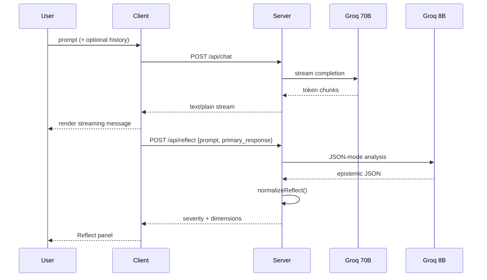

# Claude Reflect — Product Brief

Extended product documentation for reviewers, hiring managers, and design partners.  
See [README](../README.md) for setup and architecture.

---

## 1. Problem Statement (Exact)

### Observed behaviour

Knowledge workers increasingly delegate drafting, analysis, and decision support to LLMs. The interaction model is:

1. User asks a high-stakes question  
2. Model returns fluent, authoritative prose  
3. User either **trusts and acts** or **manually re-reads** for holes  

There is no in-product signal distinguishing “safe to skim” from “requires your judgment.”

### Quantified pain (N=25 survey)

- **3.16/5** trust that AI outputs are *complete* for real work  
- **88%** report being burned by wrong/incomplete AI output professionally  
- **56%** verify passively or not at all — verification is not designed into the flow  

### Root cause (systems view)

| Failure | Description |
|---------|-------------|
| **Fluency bias** | Polished language increases perceived accuracy independent of completeness |
| **Missing epistemic metadata** | Models do not expose assumption chains in the UX layer |
| **Verdict vacuum** | Users want guidance without false “correct/incorrect” labels |
| **Context asymmetry** | Model lacks user-specific constraints; user may not know what to inject |

### Problem in one sentence

> Generative AI maximizes answer quality visibility while minimizing **decision-risk visibility**.

---

## 2. Market Gap Analysis

### Competitive landscape (simplified)

```
                    High structure
                         │
    Enterprise           │     Claude Reflect
    guardrails           │     (epistemic layer)
         │               │            │
         │               │            │
Low ─────┼───────────────┼────────────┼───── High
user     │               │            │      user
burden   │   Raw chat     │  Fact-check│      burden
         │   (ChatGPT,    │  tools     │
         │    Claude…)    │            │
         │               │            │
                    Low structure
```

### Why incumbents under-serve this

- **ChatGPT / Claude / Gemini:** Optimized for conversation throughput; Reflect-like features would slow perceived latency and complicate UI.
- **Perplexity / citation tools:** Solve *source* trust, not *reasoning completeness* or *user-context gaps*.
- **Copilot in Office:** Embedded in workflows but rarely surfaces “what you didn’t ask.”

### Category opportunity

**Epistemic UX** — a new layer in the AI stack between generation and human decision.

---

## 3. Product Definition

### Jobs-to-be-done

| Job | Reflect mechanism |
|-----|-------------------|
| Know what was assumed | `reasoning_foundations` |
| Know where not to over-trust | `confidence_topology` + `severity` |
| Know what’s missing from the answer | `completeness_gaps` |
| Know what only I can supply | `judgment_prompts` |

### Non-goals (explicit)

- Not a hallucination detector with binary labels  
- Not auto-rewrite of the primary answer  
- Not a replacement for domain experts  

### UX contract

Every assistant message may carry a Reflect artifact. User can expand, dismiss, or follow up on gaps. Dismissal is remembered per message (`localStorage`).

---

## 4. Data Pipeline (Technical Product Spec)

### Sequence diagram



### Data objects

**Chat request**

```typescript
{ prompt: string; history: { role: 'user' | 'assistant'; content: string }[] }
```

**Reflect request**

```typescript
{ prompt: string; primary_response: string }
```

**Reflect response (normalized)**

```typescript
{
  severity: 'green' | 'amber';
  reasoning_foundations: string[];
  confidence_topology: string[];
  completeness_gaps: string[];
  judgment_prompts: string[];
  gap_count: number;
}
```

### Latency budget (product)

| Stage | Target | Notes |
|-------|--------|-------|
| First token (chat) | < 1s | Streaming masks total latency |
| Full chat | 3–15s | Depends on prompt |
| Reflect | < 8s | Client timeout + fallback |
| End-to-end perceived | Chat first, Reflect async | User reads while Reflect loads |

### Cost model (illustrative)

- Chat: 70B model, higher $/token  
- Reflect: 8B JSON, ~800 max tokens — cheap enough to run **per message** at scale  

---

## 5. Market Capture Strategy

### Phase 1 — Prove category (0–6 months)

- Open-source reference + Vercel demo  
- PM fellowship / Twitter / LinkedIn case study distribution  
- 5–10 design-partner interviews (PMs at startups)  

**Goal:** 1K unique demo users, 50 qualitative “I’d use this weekly” signals  

### Phase 2 — Wedge product (6–12 months)

- Chrome extension for ChatGPT/Claude web  
- “Reflect this response” API for B2B SaaS  

**Goal:** First paying team ($500–2K MRR)  

### Phase 3 — Platform (12–24 months)

- Team gap analytics, SSO, compliance exports  

**Goal:** 20+ teams, $20K+ MRR  

### Risks & mitigations

| Risk | Mitigation |
|------|------------|
| Users ignore Reflect | Auto-expand on amber; gap→follow-up one-click |
| Latency fatigue | 8B model + async UI |
| “Another AI judging AI” | Non-verdict copy in system prompt |
| Incumbent copies feature | Move fast on B2B workflow + calibration data |

---

## 6. PM Backlog (Detailed)

### Discovery

- [ ] Segment interviews: PM vs founder vs analyst  
- [ ] Track which Reflect dimension correlates with follow-up action  
- [ ] A/B: auto-expand amber vs collapsed default  

### Delivery

- [ ] Parity UX for free-form chat (no scenario required)  
- [ ] Export Reflect as markdown / Slack block  
- [ ] Mobile Reflect drawer polish  

### Growth

- [ ] Landing page with live scenario embed  
- [ ] “Reflect scorecard” share image for social proof  

### Business

- [ ] Pricing experiment: seat vs API vs freemium cap  
- [ ] Security one-pager for enterprise pilots  

---

## 7. Success Criteria (Case Study)

| Criterion | Evidence in repo |
|-----------|------------------|
| Problem grounded in data | Survey in README |
| End-to-end product | Chat + Reflect + scenarios |
| Technical depth | Dual-model pipeline, tests |
| Business thinking | Market capture + roadmap |
| Ship-ready | Vercel deploy, GitHub |

---

*Last updated: May 2026*
